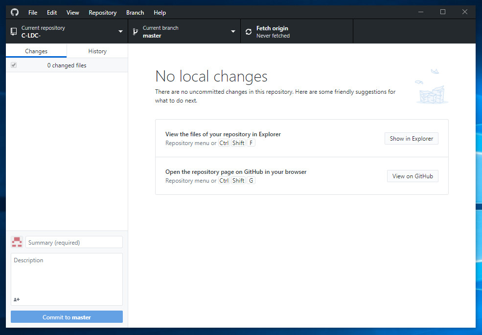
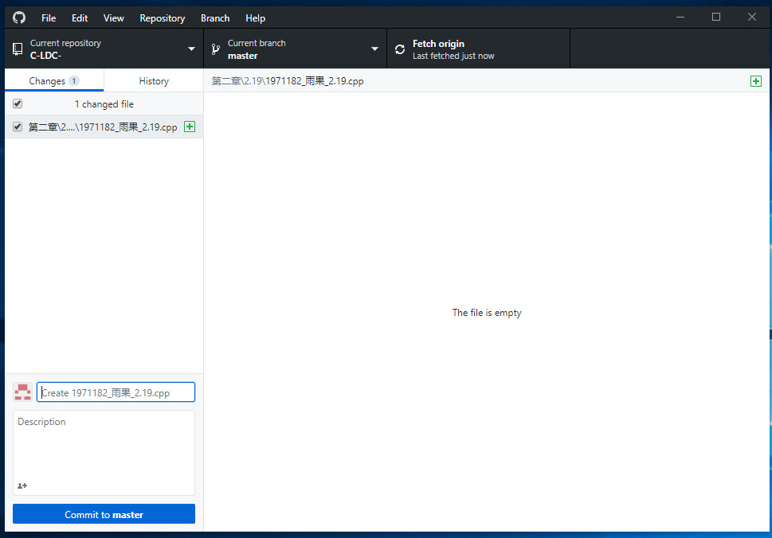
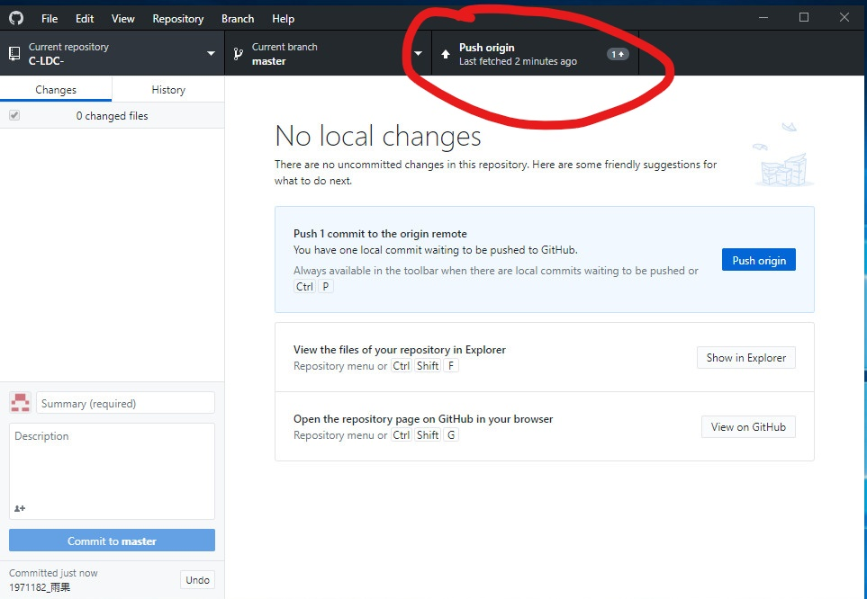

# 简介
本项目是建立自19级东北大学软件学院《程序设计基础》课程课外练习题目解答的提交地址， 同学们可以将练习题解答的C语言代码提交到本项目。
# 写在前面
1. 若提交题目没有对应文件夹，同学们可以自行创建对应文件夹。
2. 若同学们对github真的有使用困难，可以将作业以邮件的形式发送给笔者，笔者将会帮你提交作业。

# 使用教程
## 准备工作
1. 注册一个GitHub账号
2. 下载GitHub Desktop,并登陆自己的github账号。

## 图形化操作
1. 点击本项目页面的fork，
2. fork完成后，可以看到自己拥有了一份项目的拷贝，例如图中为 yuhotest / C-LDC forked from yuho8818/C-LDC
3. 点击页面clone or download, 点击clone on desktop，之后页面会跳转到客户端。
4. 在desktop客户端中选择克隆到哪个目录，点击克隆。
5. 看到如图所示即为成功。
6. 克隆完成，你能看到你选择的目录下多了一份'C-LDC'的文件夹，这意味在本地你也有了一份项目的拷贝，将作业放置到相应文件夹，如将1971181_俞浩雄_2.19.cpp 对于第二章第19题放在 '/第二章/2.19/' 目录下。
7. 打开GitHub Desktop你能看见对文件的增改，然后Commit to master，提交修改到本地。 
8. 在右上角能看到push origin，点击它，把作业提交到自己的GitHub云端。
9. 在GitHub网页页面上，进入自己的项目地址，点击Pull requests。 New 一个 pull request。
10. 对比如下图所示操作，将自己的仓库请求合并到 yuho8818/C-LDC这个仓库,Title可以输入学号姓名，点击Create pull request。.
11. 这样，你的作业就推送到了yuho8818的仓库上，也意味着你的作业交上来了。

# 问题及联系
- 若有问题请及时联系
- wechat:17681518818
- Email:yuho2916@outlook.com
- QQ:528788065
- 俞果
- 项目包含《GitHub入门与实践》完整版，有兴趣的同学可以深入学习学习
